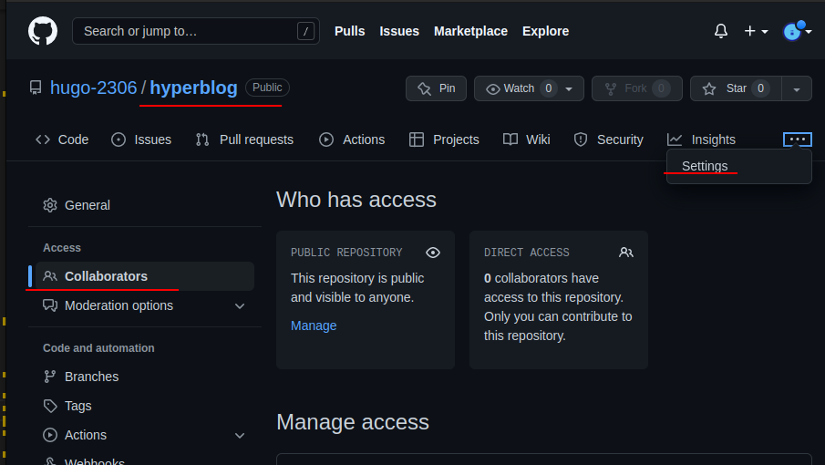

# Curso Profesional de Git y Github

¿Qué es un sistema de control de versiones?

El *SCV* o *VCS* (por sus siglas en inglés) es un sistema que registra los cambios realizados sobre un archivo o conjunto de archivos a lo largo del tiempo, de modo que puedas llevar el historial del ciclo de vida de un proyecto, comparar cambios a lo largo del tiempo, ver quién los realizó o revertir el proyecto entero a un estado anterior.

Cualquier tipo de archivo que se encuentre en un ordenador puede ponerse bajo control de versiones.

## ¿Que es GIT?

Git es un sistema de control de versiones distribuido, diseñado por Linus Torvalds. Está pensando en la eficiencia y la confiabilidad del mantenimiento de versiones de aplicaciones cuando estas tienen un gran número de archivos de código fuente. Git está optimizado para guardar todos estos cambios de forma atómica e incremental.

Se obtiene su mayor eficiencia con archivos de texto plano, ya que con archivos binarios no puede guardar solo los cambios, sino que debe volver a grabar el archivo completo ante cada modificación, por mínima que sea, lo que hace que incremente demasiado el tamaño del repositorio.

“Guardar archivos binarios en el repositorio de git es una mala práctica, únicamente deberían guardarse archivos pequeños (como logos) que no sufran casi modificaciones durante la vida del proyecto. Los binarios deben guardarse en un CDN”.

En realidad, los cambios y diferencias entre las versiones de nuestros proyectos pueden tener similitudes, algunas veces los cambios pueden ser solo una palabra o una parte específica de un archivo específico. Git está optimizado para guardar todos estos cambios de forma atómica e incremental, o sea, aplicando cambios sobre los últimos cambios, estos sobre los cambios anteriores y así hasta el inicio de nuestro proyecto.

¿Qué es Github?

Es una plataforma de desarrollo colaborativo para alojar proyectos utilizando el sistema de control de versiones Git. Se emplea principalmente para la creación de código fuente de programas de computadora.

Github puede considerarse como la red social de código para los programadores y en muchos casos es visto como tu curriculum vitae, pues aquí guardas tu portafolio de proyectos de programación.

### Instalando Git en Linux

Cada distribución de Linux tiene un comando especial para instalar herramientas y actualizar el sistema. Aquí veremos un ejemplo de los comandos para instalar Git en Linux

sudo apt-get update
sudo apt install git
git --version

Sudo significa Super User DO. Se utiliza para correr comandos con credenciales de super usuario (sin restricciones).

En las distribuciones derivadas de Debian (como Ubuntu) el comando especial es apt-get, en Red Hat es yum y en ArchLinux es pacman. Cada distribución tiene su comando especial y debes averiguar cómo funciona para poder instalar Git.

Antes de hacer la instalación, debemos hacer una actualización del sistema. En nuestro caso, los comandos para hacerlo son sudo apt-get update y sudo apt-get upgrade.

Con el sistema actualizado, ahora sí podemos instalar Git y, en este caso, el comando para hacerlo es sudo apt-get install git. También puedes verificar que Git fue instalado correctamente con el comando git --version

## Comandos básicos de git

El comando para iniciar nuestro repositorio, o sea, indicarle a Git que queremos usar su sistema de control de versiones en nuestro proyecto, es *git init*.

El comando para que nuestro repositorio sepa de la existencia de un archivo o sus últimos cambios es *git add*. Este comando no almacena las actualizaciones de forma definitiva, únicamente las guarda en algo que conocemos como “Staging Area” (área de montaje o ensayo).

El comando para almacenar definitivamente todos los cambios que por ahora viven en el staging area es *git commit*. También podemos guardar un mensaje para recordar muy bien qué cambios hicimos en este commit con el argumento -m "Mensaje del commit".

Por último, si queremos mandar nuestros commits a un servidor remoto, un lugar donde todos podamos conectar nuestros proyectos, usamos el comando *git push*.

git init: inicializa un repositorio de GIT en la carpeta donde se ejecute el comando.

git add: añade los archivos especificados al área de preparación (staging).

git commit -m “commit description”: confirma los archivos que se encuentran en el área de preparación y los agrega al repositorio, el flag *-m* es para agregar un comentario que nos sirva de referencia hacia ese commit.

git commit -am “commit description”: añade al staging area y hace un commit mediante un solo comando. (No funciona con archivos nuevos)

git status: ofrece una descripción del estado de los archivos (untracked, ready to commit, nothing to commit).

git rm (. -r, filename) (--cached): remueve los archivos del index. cached significa que está en memoria ram ósea aún no está guardado en la base de datos.

git config --global user.email.tu@email.com: configura un email.

git config --global user.name <Nombre como se verá en los commits>: configura un nombre.

git config --list: lista las configuraciones.

### ¿Qué es staging, repositorios y cuál es el ciclo básico de trabajo en GitHub?

Para iniciar un repositorio, o sea, activar el sistema de control de versiones de Git en tu proyecto, solo debes ejecutar el comando: *git init* (git espacio init) desde la terminal situado en el directorio de tu proyecto.

Este comando se encargará de dos cosas: primero, crear una carpeta .git donde se guardará toda la base de datos con *cambios atómicos* de nuestro proyecto; y segundo, crear un área en la memoria RAM, que conocemos como Staging, que guardará temporalmente nuestros archivos (cuando ejecutemos un comando especial para eso) y nos permitirá, más adelante, guardar estos cambios en el repositorio (también con un comando especial).

**Ciclo de vida o estados de los archivos en Git:**

Cuando trabajamos con Git, nuestros archivos pueden vivir y moverse entre 4 diferentes estados (cuando trabajamos con repositorios remotos pueden ser más estados pero lo estudiaremos más adelante):

- **Archivos Tracked:** Son los archivos que viven dentro de Git, no tienen cambios pendientes y sus últimas actualizaciones han sido guardadas en el repositorio gracias a los comandos *git add* y *git commit*.

- **Archivos Staged:** Son archivos en Staging. Viven dentro de Git y hay registro de ellos porque han sido afectados por el comando *git add*, aunque no sus últimos cambios. Git ya sabe de la existencia de estos últimos cambios pero todavía no han sido guardados definitivamente en el repositorio porque *falta ejecutar* el comando *git commit*.

- **Archivos Unstaged:** Entiendelos como archivos “Tracked pero Unstaged”. Son archivos que viven dentro de Git pero *no* han sido *afectados* por el comando *git add* *ni* mucho menos por *git commit*. Git tiene un registro de estos archivos pero está desactualizado, sus últimas versiones solo están guardadas en el disco duro.

- **Archivos Untracked:** Son archivos que *NO viven dentro de Git*, solo en el disco duro. Nunca han sido afectados por git add, así que Git no tiene registros de su existencia.

Recuerda que hay un caso muy raro donde los archivos tienen dos estados al mismo tiempo: Staged y Untracked. Esto pasa cuando guardas los cambios de un archivo en el área de Staging (con el comando git add) pero, antes de hacer commit para guardar los cambios en el repositorio, haces nuevos cambios que todavía no han sido guardados en el área de Staging (en realidad, todo sigue funcionando igual pero es un poco divertido).

**Comandos para mover archivos entre los estados de Git:**

- **git status:** Nos permite ver el estado de todos nuestros archivos y carpetas.

- **git add:** Nos ayuda a mover archivos del Untracked o Unstaged al estado Staged. Podemos usar git nombre-del-archivo-o-carpeta para añadir archivos y carpetas individuales o git add -A para mover todos los archivos de nuestro proyecto (tanto Untrackeds como unstageds). Se puede usar el comando *git add .* para agregar el archivo modificado en el directorio actual

- **git reset HEAD:** Nos ayuda a sacar archivos del estado Staged para devolverlos a su estado anterior. Si los archivos venían de Unstaged, vuelven allí. Y lo mismo se venían de Untracked.

- **git commit:** Nos ayuda a mover archivos de Unstaged a Staged. Esta es una ocasión especial, los archivos han sido guardado o actualizados en el repositorio. Git nos pedirá que dejemos un mensaje para recordar los cambios que hicimos y podemos usar el argumento -m para escribirlo (git commit -m "mensaje").

- **git rm:** Este comando necesita alguno de los siguientes argumentos para poder ejecutarse correctamente:

  - git rm --cached: Mueve los archivos que le indiquemos al estado Untracked.

  - git rm --force: Elimina los archivos de Git y del disco duro. Git guarda el registro de la existencia de los archivos, por lo que podremos recuperarlos si es necesario (pero debemos usar comandos más avanzados).

- **git config** Muestra las opciones de configuración

  - git config --list: Ver la configuración por defecto de Git

  - git config --list --show-origin: Ubicación de las configuraciones

  - git config --global user.name "User Name": Configura el usuario de git

  - git config --global user.email "User email": Configura el correo del usuario de git

> cuando se usa -- se debe poner el nombre completo del parámetro, cuándo se una un solo - se debe usar el modo abreviado.

- **git log** Muestra los cambios en el archivo *git log fileName*
                git log --stat: cambios especificos en los archivos a partir del comit.

- **git show** Muestra los cambios que han existido en un archivo *git show filename*
- **git diff** Compara una version vs otra del archivo *git diff version1 version2* (para ver las versiones primero ejecutar *git log*)
                También funciona para comparar cambios hechos a un archivo antes de hacer git add

### Volver en el tiempo en nuestro repositorio utilizando branches y checkout

Recordemos que tenemos directorio de trabajo, un stagging y un repositorio que es el que tiene todos los cambios.

- **git reset** Nos permite volver a una verison anterior si le colocamos enfrente la versión aterior a la que queremos volver ej. *git reset 897e...873*

    -git reset --hard: *todo* vuelve al estado anterior (cuidado borra el hitorial de cambios)

    -git reset --soft: volvemos a la version anterior pero lo que esté en staging sigue en staging.

- **git checkout** Nos permite revisar una version anterior de algún archivo ej.                *git checkout a132(version)...224 nombrearchivo.txt*

En este momento el archivo vuelve a la versión solicitada y si se hace un commit se perdería la información de la versión más reciente, para volver a la versión mas reciente ejecutamos el comando *git chekcout master nombrearchivo.txt*

## Flujo de trabajo básico con un repositorio remoto

Por ahora, nuestro proyecto vive únicamente en nuestra computadora. Esto significa que no hay forma de que otros miembros del equipo trabajen en él.

Para solucionar esto están los servidores remotos: un nuevo estado que deben seguir nuestros archivos para conectarse y trabajar con equipos de cualquier parte del mundo.

Estos servidores remotos pueden estar alojados en GitHub, GitLab, BitBucket, entre otros. Lo que van a hacer es guardar el mismo repositorio que tienes en tu computadora y darnos una URL con la que todos podremos acceder a los archivos del proyecto para descargarlos, hacer cambios y volverlos a enviar al servidor remoto para que otras personas vean los cambios, comparen sus versiones y creen nuevas propuestas para el proyecto.

Esto significa que debes aprender algunos nuevos comandos:

- **git clone url_del_servidor_remoto:** Nos permite descargar los archivos de la última versión de la rama principal y todo el historial de cambios en la carpeta .git.

- **git push:** Luego de hacer git add y git commit debemos ejecutar este comando para mandar los cambios al servidor remoto.

- **git fetch:** Lo usamos para traer actualizaciones del servidor remoto y guardarlas en nuestro repositorio local (en caso de que hayan, por supuesto).

- **git merge:** También usamos el comando git fetch con servidores remotos. Lo necesitamos para combinar los últimos cambios del servidor remoto y nuestro directorio de trabajo.

- **git pull:** Básicamente, git fetch y git merge al mismo tiempo.

### Introducción a las ramas o branches de Git

Las ramas son la forma de hacer cambios en nuestro proyecto sin afectar el flujo de trabajo de la rama principal. Esto porque queremos trabajar una parte muy específica de la aplicación o simplemente experimentar.

La cabecera o HEAD representan la rama y el commit de esa rama donde estamos trabajando. Por defecto, esta cabecera aparecerá en el último commit de nuestra rama principal. Pero podemos cambiarlo al crear una rama (git branch rama, git checkout -b rama) o movernos en el tiempo a cualquier otro commit de cualquier otra rama con los comandos (git reset id-commit, git checkout rama-o-id-commit).

- **git commit -am:** Este comando automáticamente hace el **git add** de los cambios pero solo funciona con archivos a los que ya les habiamos hecho **git add** previamente.
*git commit -am "mensaje del commit"*
*git commit -a* (abre el editor de texto para agregar el mensaje al commit)

- **git branch:** Con este comando creamos la rama
*git branch nombreDeLaRama* ej git branch cabecera
    también podemos saber en que rama estamos *git branch*

- **git show:** Con este comando podemos saber hacia que rama está apuntando el **HEAD**.

- **git checkout** Con este comando nos cambiamos de la rama master a la rama que queremos y viceversa.

*git checkout nombreDeLaRama* ej git chekout cabecera

El bash cambia de (master) a (nombreDeLaRama)
Con Git status puedes revisar la rama en la que te encuentras trabajando. Es importante recordar que si haces un cambio en alguna de las ramas o master y no haces comit antes de hacer checkout, vas a perder tus cambios.

- **git merge** Con este comando fusionamos la rama alterna y la rama master. Lo debemos hacer desde master. Este comando es un commit por lo que también hay que agregarle un mensaje.

> *git merge nombre_de_la_rama*

Una vez fusionados si usamos el comando *git status* podremos ver los commits de master y el último commit del branch que fusionamos y el commit más reciente será la fusión de estos dos. Merge: 43b23b 535n3i

### Resolución de Conflictos al hacer un merge

Git nunca borra nada, a menos que nosotros se lo indiquemos. Cuando usamos los comandos git merge o git checkout estamos cambiando de rama o creando un nuevo commit, no borrando ramas ni commits (recuerda que puedes borrar commits con git reset y ramas con git branch -d).

Git es muy inteligente y puede resolver algunos conflictos automáticamente: cambios, nuevas líneas, entre otros. Pero algunas veces no sabe cómo resolver estas diferencias, por ejemplo, cuando dos ramas diferentes hacen cambios distintos a una misma línea.

Esto lo conocemos como conflicto y lo podemos resolver manualmente. Solo debemos hacer el merge, ir a nuestro editor de código y elegir si queremos quedarnos con alguna de estas dos versiones o algo diferente. Algunos editores de código como Visual Studio Code nos ayudan a resolver estos conflictos sin necesidad de borrar o escribir líneas de texto, basta con hacer clic en un botón y guardar el archivo.

Recuerda que siempre debemos crear un nuevo commit para aplicar los cambios del merge. Si Git puede resolver el conflicto, hará commit automáticamente. Pero, en caso de no pueda resolverlo, debemos solucionarlo y hacer el commit.

Los archivos con conflictos por el comando *git merge* entran en un nuevo estado que conocemos como Unmerged. Funcionan muy parecido a los archivos en estado Unstaged, algo así como un estado intermedio entre Untracked y Unstaged, solo debemos ejecutar git add para pasarlos al área de staging y git commit para aplicar los cambios en el repositorio.

### Cómo revertir un merge

Si nos hemos equivocado y queremos cancelar el merge, debemos usar el siguiente comando:

> *git merge --abort*

### Conflictos en repositorios remotos

Al trabajar con otras personas, es necesario utilizar un repositorio remoto.
­
-Para copiar el repositorio remoto al directorio de trabajo local, se utiliza el comando *git clone \<url\>*, y para enviar cambios al repositorio remoto se utiliza *git push*.

-Para actualizar el repositorio local se hace uso del comando *git fetch*, luego se debe fusionar los datos traídos con los locales usando *git merge*.

### Cambios en GitHub: de master a main

Desde el 1 de octubre de 2020 GitHub cambió el nombre de la rama principal: ya no es “master” (cómo aprenderás en el curso) sino main.

Este derivado de una profunda reflexión ocasionada por el movimiento #BlackLivesMatter.

La industria de la tecnología lleva muchos años usando términos como master, slave, blacklist o whitelist y esperamos pronto puedan ir desapareciendo.

### Uso de GitHub

*GitHub* es una plataforma que nos permite guardar repositorios de Git que podemos usar como servidores remotos y ejecutar algunos comandos de forma visual e interactiva (sin necesidad de la consola de comandos).

Luego de crear nuestra cuenta, podemos crear o importar repositorios, crear organizaciones y proyectos de trabajo, descubrir repositorios de otras personas, contribuir a esos proyectos, dar estrellas y muchas otras cosas.

El *README.md* es el archivo que veremos por defecto al entrar a un repositorio. Es una muy buena práctica configurarlo para describir el proyecto, los requerimientos y las instrucciones que debemos seguir para contribuir correctamente.

Para clonar un repositorio desde GitHub (o cualquier otro servidor remoto) debemos copiar la URL (por ahora, usando HTTPS) y ejecutar el comando git clone + la URL que acabamos de copiar. Esto descargara la versión de nuestro proyecto que se encuentra en GitHub.

Sin embargo, esto solo funciona para las personas que quieren empezar a contribuir en el proyecto.

### Cómo conectar un repositorio de Github a nuestro documento local

Si queremos conectar el repositorio de GitHub con nuestro repositorio local, el que creamos con git init, debemos ejecutar las siguientes instrucciones:

- Primero: Crear un nuevo repositorio en Github:
  
  - Nombre

  - Descripción

  - Público o Privado

  - Iniciar el repositorio con un Readme.md es una buena pŕactica para indicar de que trata el repositorio o tu proyecto.

  - Copiar la URL del proyecto dando click en clone or download: Clone with HTTPS (por ahora).

  - En la terminal dentro de la rama master hay que indicarle a Git que vamos a agregar un *origen remoto* de nuestros archivos (la URL del repositorio de GitHub que acabamos de copiar):

    > *git remote add origin URL*

- Segundo: Verificar que la URL se haya guardado correctamente:

    > *git remote*

    >  Origin

    > *git remote -v*

    > origin  git@github.com:hugo-2306/hyperblog.git (fetch)

    > origin  git@github.com:hugo-2306/hyperblog.git (push)

Ahora tenemos un origin para hacer fetch ("traer cosas") y push ("enviar cosas").

- Tercero: Traer la versión del repositorio remoto (que en este momento solo tiene el Readme.md) y hacer merge para crear un commit con los archivos de ambas partes. Podemos usar *git fetch* y *git merge* o solo el *git pull* con el flag *--allow-unrelated-histories*:

    > *git pull origin master* *--allow-unrelated-histories*

Nota: las historias son los commits.

- Por último, ahora sí podemos hacer git push para guardar los cambios de nuestro repositorio local en GitHub:

    > *git push origin master*

Esta instrucción se lee cómo: git envía a origen la rama master.

### Cómo funcionan las llaves públicas y privadas

Las llaves públicas y privadas, conocidas también como cifrado asimétrico de un solo camino, sirven para mandar mensajes privados entre varios nodos con la lógica de que firmas tu mensaje con una llave pública vinculada con una llave privada que puede leer el mensaje.

Las llaves públicas y privadas nos ayudan a cifrar y descifrar nuestros archivos de forma que los podamos compartir sin correr el riesgo de que sean interceptados.

### Cómo funciona un mensaje cifrado con llaves públicas y privadas

1. Ambas personas deben crear su llave pública y privada.

2. Ambas personas pueden compartir su llave pública a las otras partes (recuerda que esta llave es pública, no hay problema si la “interceptan”).

3. La persona que quiere compartir un mensaje puede usar la llave pública de la otra persona para cifrar los archivos y asegurarse que solo puedan ser descifrados con la llave privada de la persona con la que queremos compartir el mensaje.

4. El mensaje está cifrado y puede ser enviado a la otra persona sin problemas en caso de que los archivos sean interceptados.

5. La persona a la que enviamos el mensaje cifrado puede emplear su llave privada para descifrar el mensaje y ver los archivos.

Nota: puedes compartir tu llave pública, pero nunca tu llave privada.

### Configura tus llaves SSH en local

Revisar que el usuariode git este configurado:

- *git config -l*

Si no lo está se configura con el comand: *git config --global user.email "email.usuario@email.com"*

> user.email=email.usuario@email.com

El correo debe ser el correcto, el nombre de usuario no importa tanto.

Las llaves SSH se configuran por usario, no por proyecto o repositorio.

Desde el home de mi usuario vamos a crear las llaves SSH usando la terminal.

*ssh-keygen -t rsa -b 4096 -C "email.usuario@email.com"*

Con el parámetro -t indicamos el algoritmo que vamos a usar, en este caso es RSA.

El parámetro -b seguido de 4096 indica la complegidad de la llave desde una perspectiva matemática.

El parámetro -C indica a que correo electrónico va a estar conectada la llave.

Una vez que terminamos de escribir el correo podemos darle enter y nos va a preguntar dónde queremos guardar la llave, podemos usar la ruta que nos sugiere que es lo más recomendable.

Después nos va a preguntar si queremos agregar un passphrase, ósea una contraseña con espacios. Es una contraseña adicional de texto que se le puede agregar a las llaves. Lo recomendable es agregar una, sin embargo este paso se puede omitir.

El siguiente paso mostará la ruta donde se guardaron la llave pública y privada y nos mostrará un key fingerprint para indicarnos que la llave esta creada y algo llamado random art image que también sirve para compartir la llave.

Una vez que tenemos la llave debemos asegurarnos que el servidor de llaves SSH esté prendido. Básicamente es un programa corriendo que revisa que las llaves estén listas y que las conecte para hacer la conexión doble cuando nos conectemos a un servidor remoto o a github.

*eval $(ssh-agent -s)*

El resultado debe ser el siguiente:

Agent pid 9898

Dónde agent significa que el servidor SSH está corriendo, pid significa process ID y a su lado está el id del proceso. El número de PID puede variar.

Después de creada tenemos que agregarla al servidor.

~ la tilde de la ñ funciona como una variable para indicar el home del usuario.

para agregar la llave usamos el siguiente comando:

*ssh-add ~/.ssh/id_rsa*

Estamos agregando la llave privada, al darle enter nos debe mostrar un mensaje que diga Identity added seguido de la ruta y el correo del usuario.


El procedimiento en Mac es diferente.

Después de ejecutar el comando en la terminal para crear las llaves, hay que agregarlas al servidor ssh, pimero asgurandonos que el servidor SSH está corriendo:

*eval "$(ssh-agent -s)"*

En Mac tenemos que aseguarnos de que exista el archivo .config dentro del direcorio .ssh si no existe hay que crearlo.

El contenido del archivo debe ser el siguiente:

```

Host *

  AddKeysToAgent yes
  UseKeyChain yes
  IdentityFile ~/.ssh/id_rsa

```

Se guarda sin extensión.

Despues volvemos al home y ejecutamos el siguiente comando:

*ssh_add -K ~/.ssh/id_rsa*

Nos debe mostrar el mensaje de *Identity added*

el flag -K en Mac es para el Key Chain, que es una aplicación del Sistema operativo donde se guardan los nombres de usuario y contraseñas.

Si al usar el flag nos da un error lo deberemos quitar.

### Conexión a GitHub con SSH

Cada usuario tene que tener su propia llave SSH ejemplo, si tienes 3 laptops tienes que tener 3 llaves diferentes conectadas con el repositorio.

Para agregar la llave pública a git hub hay que copiar el contenido del archivo id_rsa.pub despues ir al perfil de Github -> Settings -> SSH and GPG keys -> New SSH key

Te mostrará dos campos en uno te pedira un título para la llave, que debería ser una referencia al equipo al que estará conectada, y en el otro campo debes pegar la llave.

Después te debe de pedir tu contraseña de github y al ingresarla te mostrará una pantalla con tu llave agregada.

>Después de esto ya pude descargar el repositorio a mi local usando el comando:

>*git clone git@github.com:hugo-2306/hyperblog.git*

>Al descargarlo me pidió mi passphrase.


Con el comando *git remote -v*  podemos saber cual es la URL de nuestro repositorio.


Vemos 2 repos por que a uno se le hace fetch y a otro push, pueden ser distintos, en general no lo son pero pueden ser.

Origin es un estandar de la industria.

Si queremos cambiar el URL de nuestro repositorio lo hacemos con el siguiente comando:

*git remote set-url origin*

ejemplo:

git remote set-url origin <https://github.com/hugo-2306/hyperblog.git>

o para ssh

git remote set-url origin git@github.com:hugo-2306/hyperblog.git

después ejecutamos de nuevo git remote -v para ver el cambio.

El comando *git pull origin master* lo deberiamos ejecutar antes de hacer un push para verificar que no haya cambiado nada en origin y que estamos trabajando con la versión más actualizada del código.

### Tags y versiones en Git y GitHub

Los tags o etiquetas nos permiten asignar versiones a los commits con cambios más importantes o significativos de nuestro proyecto.

Para ver toda la historia de nuestro proyecto de un modo gráfico en la terminal podemos usar el siguiente comando:

> *git log --all --graph --decorate --oneline*


Para no tener que memorizar todos los parámetros podemos usar un alias de git y configurarlo de modo global para que esté disponible en todos los proyectos, se hace de la siguiente manera:

> *git config --global alias.greatlog "log --graph --abbrev-commit --decorate --date=relative --format=format:'%C(bold blue)%h%C(reset) - %C(bold green)(%ar)%C(reset) %C(white)%s%C(reset) %C(dim white)- %an%C(reset)%C(bold yellow)%d%C(reset)' --all"*

para ejecutarlo la siguiente vez solo tendremos que escribir:

> *git greatlog*

Ya que indetificamos en que commit queremos agregar el tag podemos crearlo de la siguiente manera, primero hay que copiar el hash del commit y después ejecutar el siguiente comando:

> *git tag -a v0.1 -m "Resultado de las primeras clases del curso" hashdelcommit*

El flag **-a** indica que se va a agregar un tag y seguido de esta ponemos un nombre, por convención se pone una **v** y la versión en este caso la 0.1

Después hay que agregar un mensaje tal cómo si fuera un commit y seguido del mensaje hay que colocar el hash del commit. Listo ya quedó creado el tag.

Para listar los tags podemos escribir:

> *git tag*

Si queremos conocer a que hash o que commit está conectado el hash deberemos escrbir el siguiente comando:

> *git show-ref -- tags*

Los tags no se registran como cambios para enviar el servidor sin embargo la idea es que los demás desarrolladores puedan tener una referencia.

Para enviarlos usamos el siguiente comando:

> *git push origin --tags*

Para borrar un tag se usa el siguiente comando:

> *git tag -d nombre-del-tag*

Después para borrarlo del repositorio remoto se puede usar la interfaz gráfica desde github o ejecutar el siguiente comando:

> *git push origin :refs/tags/nombre-del-tag*

### Manejo de ramas en GitHub

Las ramas nos permiten hacer cambios a nuestros archivos sin modificar la versión principal (master). Puedes trabajar con ramas que nunca envías a GitHub, así como pueden haber ramas importantes en GitHub que nunca usas en el repositorio local. Lo importante es que aprendas a manejarlas para trabajar profesionalmente.

Si, estando en otra rama, modificamos los archivos y hacemos commit, tanto el historial(git log) como los archivos serán afectados. La ventaja que tiene usar ramas es que las modificaciones solo afectarán a esa rama en particular. Si luego de “guardar” los archivos(usando commit) nos movemos a otra rama (git checkout otraRama) veremos como las modificaciones de la rama pasada no aparecen en la *otraRama*.

### Comandos para manejo de ramas en GitHub

- Crear una rama:

    *git branch branchName*

- Movernos a otra rama:

    *git checkout branchName*

- Crear una rama en el repositorio local:

    *git branch nombre-de-la-rama* o*git checkout -b nombre-de-la-rama*

- Publicar una rama local al repositorio remoto:

    *git push origin nombre-de-la-rama*

Este último comando se ejecuta desde la rama que se va enviar a github.

Recuerda que podemos ver gráficamente nuestro entorno y flujo de trabajo local con Git utilizando el comando gitk. Gitk fue el primer visor gráfico que se desarrolló para ver de manera gráfica el historial de un repositorio de Git.

### Configurar múltiples colaboradores en un repositorio de GitHub

Por defecto, cualquier persona puede clonar o descargar tu proyecto desde GitHub, pero no pueden crear commits, ni ramas. Esto quiere decir que pueden copiar tu proyecto pero no colaborar con él. Existen varias formas de solucionar esto para poder aceptar contribuciones. Una de ellas es añadir a cada persona de nuestro equipo como colaborador de nuestro repositorio.

Cómo agregar colaboradores en Github

Solo debemos entrar a la configuración de colaboradores de nuestro proyecto. Se encuentra en:

Repositorio > Settings > Collaborators
Ahí, debemos añadir el email o username de los nuevos colaboradores.



El nuevo colaborador **no** tiene que hacer un *git init* en la carpeta dónde va a alojar el proyecto, lo que tiene que hacer el nuevo colaborado es clonar el repositorio con el comando *git clone url_del_repositorio*

Al clonar el repositorio si es público no te pedirá usuario ni contraseña.

Si el nuevo colaborador intenta hacer un commit sin haber sido añadido le va a mostrar un error de permisos.

## Flujos de trabajo profesionales

### Flujo de trabajo profesional: Haciendo merge de ramas de desarrollo a master

Para poder desarrollar software de manera óptima y ordenada, necesitamos tener un flujo de trabajo profesional, que nos permita trabajar en conjunto sin interrumpir el trabajo de otros desarrolladores. Una buena práctica de flujo de trabajo sería la siguiente:

- Crear ramas

- Asignar una rama a cada programador

- El programador baja el repositorio con git pull origin master

- El programador cambia de rama

- El programador trabaja en esa rama y hace commits

- El programador sube su trabajo con git push origin #nombre_rama

- El encargado de organizar el proyecto baja, revisa y unifica todos los cambios.

Las mejores prácticas dicen que los Binarios (en este caso imágenes) no se deben de guardar en los repositorios.

¿Como actualizo mis ramas con el código de master?

De [Stackoverflow](https://stackoverflow.com/questions/3876977/update-git-branches-from-master):

Merge, but this creates an extra commit for the merge.

Checkout each branch: *git checkout desired_branch*

Then merge: *git merge origin/master*

Then push: *git push origin desired_branch*

### Flujo de trabajo profesional con Pull requests

Durante el curso hemos hecho merge a la rama master directamente desde las ramas de desarrollo (header y footer) pero en un entorno profesional normalmente se bloquea la rama master y para poder envíar código a esa rama pasa por un *code review* y luego de su aprobación se unen los códigos con los *merge request*.

Para realizar pruebas enviamos el código a servidores que normalmente los llamamos staging develop (servidores de pruebas) luego de que se realizan las pruebas pertinentes tanto de código como de la aplicación estos pasan al servidor de producción con el ya antes mencionado merge request.

En un entorno profesional, antes de hacer el merge del código hay un estado intermedio que se conoce cómo *Pull Request* (PR) que nos permite que otros miembros del equipo puedan ver los cambios, validen el código y lo aprueben, al aprobarlos el merge se autoejecuta. El Pull Request no es una característica de Git si no de **GitHub**.

El Pull Request también es importante por que le permite a personas que no son colaboradores trabajar y apoyar en una rama.

Los *Dev Ops* son administradores del entorno de desarrollo y hacen que la vida de los programadores sea más fácil y que los equipos de trabajo trabajen de manera efectiva.

### Utilizando Pull Requests en GitHub

Al hacer un pull request, se genera una conversación que pueden seguir los demás usuarios del repositorio, así como autorizar y rechazar los cambios.

¿Cómo se realiza un pull request?

- Se trabaja en una rama paralela los cambios que se desean *git checkout -b <rama>*

- Se hace un commit a la rama *git commit -am '<Comentario>'*

- Se suben al remoto los cambios *git push origin <rama>*

- En GitHub se hace el pull request comparando la rama master con la rama del fix.

- Uno, o varios colaboradores revisan que el código sea correcto y dan feedback (en el chat del pull request).

- El colaborador hace los cambios que desea en la rama y lo vuelve a subir al remoto (automáticamente jala la historia de los cambios que se hagan en la rama, en remoto).

- Se aceptan los cambios en GitHub.

- Se hace merge a master desde GitHub.

Importante: Cuando se modifica una rama, también se modifica el pull request.

### Creando un Fork, contribuyendo a un repositorio

Los **forks** o bifurcaciones son una característica única de *GitHub* en la que se crea una copia exacta del estado actual de un repositorio directamente en GitHub. Este repositorio podrá servir como otro origen y se podrá clonar (como cualquier otro repositorio). En pocas palabras, lo podremos utilizar como un nuevo repositorio git.

Un fork es una bifurcación del repositorio completo. Comparte una historia en común con el original, pero se bifurca y pueden haber varios cambios, ya que ambos proyectos podrán ser modificados en paralelo. Para estar al día un colaborador tendrá que estar actualizando su fork con la información del original.

Al hacer un fork de un proyecto en GitHub, te conviertes en dueñ@ del repositorio fork y puedes trabajar en este con todos los permisos, pero es un repositorio completamente diferente al original, teniendo solamente alguna historia en común (como crédito al creado o creadora original).

Los forks son importantes porque es la manera en la que funciona el open source, ya que una persona puede no ser colaborador de un proyecto, pero puede contribuír al mismo, haciendo mejor software que pueda ser utilizado por cualquiera.

Para hacer fork a un repositorio en github solo hay que darle click al botón de fork en el proyecto deseado y github hará la copia hacia tu perfil.

Después para poder empezar a hacer cambios hay que clonarlo desde nuestro directorio de trabajo.

> *git clone url-del-proyecto-en-mi-repositorio-de-github*

Una vez hechos los cambios en local hago push a mi repositorio.

El paso siguiente sería envíar desde mi repositorio en Github los cambios al repositorio original.

Github sabe que mi repositorio es una copia de otro entonces lo que tengo que hacer es dar click en el bóton de *New pull request*, esto abrirá una nueva interfaz en Github dónde me pediran escoger que ramas deseo comparar para saber cuales son los cambios y ejecutar posteriormente el pull request, también me permite comparar entre forks.

Ya que comparamos los archivos y vimos nuestros cambios podemos dar click en el botón *Create Pull Request*. Recordemos que un pull request es cómo un commit intermedio por lo que también deberemos agregar un mensaje que acompañe a nuestro commit.

Después de darle click se creará una convesación en la pestaña de pull requests. En este momento el pull request se queda en espera de validación, yo tengo la opción de cerrarlo que sería como cancelar la solicitud.

El dueño del repositorio original recibe una alerta de que tiene una solicitud de pull request, después de revisar el código del pull request puede dar click en el botón de Review Changes dónde podrá aprobar o solicitar algún cambio al código propuesto en el pull request.

Si lo aprueba lo siguiente es hacer merge al pull request. Al hacer el merge ahora se tiene también en el historial del proyecto original los commits del proyecto clonado.

Cuando el repositorio original es modificado los forks se van quedando resagados con respecto al proyecto original. Para poder traer el código más reciente del original al fork desde github se puede dar click al botón fetch upstream para que haga fetch y merge, se puede también comparar los códigos y después hacer un pull request.

También se puede hacer desde consola. En la carpeta donde está el fork se debe crear otra fuente de origen del código, esto se hace con el siguiente comando:

> *git remote add upstream  url-del-proyecto-original*

La palabra upstream es convencional, no es obligatorio que ese sea el nombre.

Al ejecutar el comando git remote -v podremos ver nuestra nueva fuente *upstream* junto con *origin*.

Por último deberemos hacer pull del nuevo origen a master:

> *git pull upstream master*

Este pull nos traerá los cambios del remoto, por lo que se estará al día en el proyecto. *El flujo de trabajo cambia, en adelante se estará trabajando haciendo pull desde upstream y push a origin para después hacer un pull request.*

### Ignorar archivos en el repositorio con .gitignore

No todos los archivos que agregas a un proyecto deberían ir a un repositorio. Por ejemplo, cuando tienes un archivo donde están tus contraseñas, o archivosde configuración del entorno de desarollo que comúnmente tienen la extensión .env, o cuando te estás conectando a una base de datos; son archivos que nadie debe ver.

También hay archivos que al estar en el repositorio ralentizan el proceso de desarrollo (por ejemplo: los binary large objects, blob, que tardan en descargarse)

Otro tipo de archivos que se deben ignorar son los que se generan al ejecutar comandos, por ejemplo la carpeta node_modules, que genera npm al correr el comando npm install

Para que no se suban estos archivos no deseados se debe crear un archivo con el nombre .gitignore en la raíz del repositorio con las reglas para los archivos que no se deberían subir: Aquí puedes ver la [sintaxis del achivo .gitignore.](https://git-scm.com/docs/gitignore)

Ejemplo del conteido de un archivo .gitignore:

*.jpg

Con esto el archivo ignorará todos los arhivos jpg del proyecto y no los enviará al repositorio, la opción correcta para agregar este tipo de archivos es a través de un CDN.

Puedes tomar ejemplos de archivos .gitignore otros proyectos open source profesionales en github, esta es la manera en la que todo el mundo aprende.
